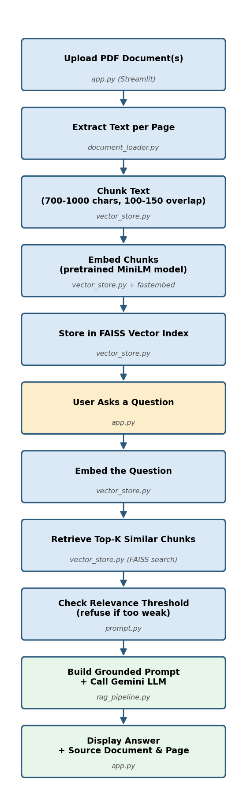

# Domain-Specific RAG Chatbot for PDF Question Answering

A Retrieval-Augmented Generation (RAG) chatbot that answers questions from
uploaded PDF documents -- policies, handbooks, manuals, or any domain of
your choosing. Answers are grounded only in the uploaded documents, cite
their source (document + page number), and the chatbot explicitly refuses
to guess when the answer isn't present.



## Project Overview

- **Problem it solves:** large documents are tedious to search manually.
  This tool lets a user upload PDFs and ask questions in plain language,
  getting a grounded answer with a citation instead of reading page by page.
- **Approach used:** the "beginner approach" from the project brief --
  `pypdf` for extraction, LangChain's `RecursiveCharacterTextSplitter` for
  chunking, a pretrained sentence-embedding model for vector search via
  FAISS, and Google Gemini (`gemini-3.6-flash`) for grounded answer generation.
- **Sample domain:** this submission uses 4 fictional HR policy documents
  for a fictional company, "Solstice Retail Pvt Ltd" (Employee Handbook,
  Leave Policy, Attendance Policy, Code of Conduct) -- see `documents/`.
  Upload your own PDFs in the sidebar to try a different domain.

## Folder Structure

```
domain_rag_chatbot/
|-- app.py                        # Streamlit chat interface (entry point)
|-- rag_pipeline.py                 # Orchestrates retrieval + LLM generation
|-- document_loader.py                # PDF validation + text extraction (pypdf)
|-- vector_store.py                     # Chunking + embeddings + FAISS index
|-- prompt.py                             # Grounded-answer guardrail prompt
|-- requirements.txt
|-- README.md
|-- .env.example                          # GOOGLE_API_KEY template
|-- .gitignore
|-- build_sample_documents.py               # Regenerates the 4 sample HR PDFs
|-- build_architecture_diagram.py             # Regenerates architecture_diagram.png
|-- build_project_report.py                    # Regenerates the project report PDF
|-- run_pipeline_test.py                         # End-to-end retrieval + refusal test
|-- architecture_diagram.png
|
|-- documents/                              # 4 sample HR policy PDFs (fictional company)
|   |-- Employee_Handbook.pdf
|   |-- Leave_Policy.pdf
|   |-- Attendance_Policy.pdf
|   |-- Code_of_Conduct.pdf
|
|-- vector_store/
|   |-- saved_index/                          # FAISS index persists here if you call VectorStore.save()
|
|-- tests/
    |-- test_questions.csv                      # 20-question testing sheet
    |-- evaluation_notes.md                       # Extraction/retrieval/refusal/groundedness notes
```

## Setup

1. **Create and activate a virtual environment** (recommended):
   ```
   python -m venv venv
   # Windows:
   venv\Scripts\activate
   # Mac/Linux:
   source venv/bin/activate
   ```

2. **Install dependencies:**
   ```
   pip install -r requirements.txt
   ```

3. **Add your Google API key:**
   ```
   cp .env.example .env
   ```
   Edit `.env` and set `GOOGLE_API_KEY` to a free key from
   [aistudio.google.com/apikey](https://aistudio.google.com/apikey). The
   app still runs and lets you process documents without a key, but
   answer generation needs it.

4. **Run the app:**
   ```
   streamlit run app.py
   ```
   This opens the dashboard at `http://localhost:8501`.

5. **Try it out:** in the sidebar, either upload your own PDF(s) or check
   "Use the bundled sample HR documents", click **Process Documents**,
   then ask a question in the chat box -- for example *"What is the leave
   policy?"* or *"How is attendance calculated?"*.

## How It Works

See `architecture_diagram.png` for the full pipeline. In short:

1. **Upload** (`app.py`) -- accepts one or more PDF files.
2. **Extract** (`document_loader.py`) -- pulls text from every page via
   `pypdf`, keeping the document name and page number as metadata, and
   skips empty/scanned pages safely.
3. **Chunk** (`vector_store.py`) -- splits each page's text into
   900-character chunks with 130-character overlap using LangChain's
   `RecursiveCharacterTextSplitter`, so ideas that span a chunk boundary
   aren't lost.
4. **Embed** (`vector_store.py`) -- converts every chunk into a 384-dim
   vector using the pretrained `sentence-transformers/all-MiniLM-L6-v2`
   model (see "Embedding model" note below).
5. **Store** (`vector_store.py`) -- indexes all chunk vectors in a FAISS
   `IndexFlatIP` (cosine similarity via normalized inner product).
6. **Retrieve** (`vector_store.py`) -- embeds the user's question and
   retrieves the top 4 most similar chunks.
7. **Guardrail check** (`prompt.py`) -- if even the top retrieved chunk's
   similarity score is below a tuned threshold, the chatbot refuses
   instead of guessing (`"I could not find this information in the
   uploaded documents."`).
8. **Generate** (`rag_pipeline.py`) -- otherwise, builds a strict
   context-only prompt and calls Google Gemini (`gemini-3.6-flash`) to
   produce a grounded answer.
9. **Display** (`app.py`) -- shows the answer in the chat, with a
   "Sources" expander listing every document + page number used.

### Embedding model note

The brief names `sentence-transformers/all-MiniLM-L6-v2` as the beginner
embedding model. This project loads that **exact model** through the
`fastembed` library (ONNX Runtime) rather than the `sentence-transformers`
/ PyTorch package -- same pretrained weights, same 384-dim embedding
space, just a much lighter dependency footprint (no PyTorch/CUDA
required). If you have PyTorch available, `vector_store.py` documents a
one-line drop-in swap to `sentence_transformers.SentenceTransformer` in a
comment.

`fastembed` downloads the ONNX model files from `huggingface.co` on first
use. If that host is unreachable for any reason, `vector_store.py`
automatically falls back to an offline `TfidfVectorizer` and prints a
clear warning saying so, so the app degrades gracefully instead of
crashing -- see `tests/evaluation_notes.md` for full details on this
fallback and how the pipeline was tested with it.

## Testing

Run the automated end-to-end retrieval + refusal check:

```
python run_pipeline_test.py
```

This verifies, for all 20 questions in `tests/test_questions.csv`, that
(a) answerable questions retrieve the correct source document and page,
and (b) the 3 "not available" questions are correctly refused by the
relevance threshold. **Result: 20/20 passed.** See
`tests/evaluation_notes.md` for the full breakdown, plus instructions for
verifying live answer generation with your own `GOOGLE_API_KEY`.

## Responsible AI and Security

This tool follows the Responsible AI and Security rules from the project
brief:

- **Grounded only** -- the system prompt instructs the model to answer
  only from the retrieved context and to say so explicitly when the
  answer isn't available, rather than inventing facts.
- **Source citations** -- every answer that isn't a refusal shows which
  document and page number it came from.
- **No blind trust** -- the app displays a Responsible AI notice asking
  users to verify high-stakes information against the original source.
- **Prompt-injection resistance** -- the system prompt explicitly
  instructs the model to treat any instruction-like text found inside an
  uploaded document (or the user's question) as ordinary content, never
  as a new instruction to the assistant.
- **No permanent storage** -- uploaded files are processed in memory for
  the current session only; nothing is written to disk unless you
  explicitly call `VectorStore.save()`.
- **No API keys in code or GitHub** -- `.env` (with your real key) is
  gitignored; only `.env.example` (a template) is committed.
- **File limits** -- uploads are validated for PDF type and a 20 MB size
  cap before processing.

## Limitations

- **Retrieval quality depends on the embedding backend.** With the real
  pretrained MiniLM model (the default), retrieval is semantic and
  handles paraphrasing well. The offline TF-IDF fallback (used only if
  that model can't be downloaded) is keyword-based and can be less
  accurate on paraphrased questions -- see `tests/evaluation_notes.md`.
- **No OCR** -- scanned/image-only PDFs are not supported; a clear error
  is raised instead of silently returning empty text.
- **A RAG chatbot can still be wrong** even when grounded -- retrieval
  might miss the most relevant passage, or the LLM might misread the
  retrieved context. Always verify high-stakes answers against the
  source document.
- **Single-session, single vector store** -- documents are re-processed
  each time you click "Process Documents"; there's no persistent
  multi-user document library (see "Optional Advanced Features" below
  for the multi-collection upgrade path).

## Deployment

To deploy to Streamlit Community Cloud:

1. Push this folder to a GitHub repository (see below).
2. Go to [share.streamlit.io](https://share.streamlit.io), sign in with
   GitHub, and select this repository + `app.py` as the entry point.
3. Add `GOOGLE_API_KEY` as a secret in the Streamlit Cloud app settings.
4. Streamlit Cloud installs `requirements.txt` and deploys automatically.

## Pushing to GitHub

```
cd domain_rag_chatbot
git init
git add .
git commit -m "Initial commit: Domain-Specific RAG Chatbot for PDF Question Answering"
git branch -M main
git remote add origin https://github.com/<your-username>/<your-repo-name>.git
git push -u origin main
```
